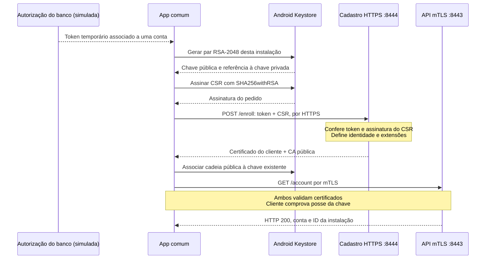

# Banco Lab: cadastro HTTPS e autenticação mTLS no Android

Laboratório de um aplicativo bancário comum, instalado como um app de terceiros.
O Android gera uma chave privada no **Android Keystore**, envia um **CSR por HTTPS**
e recebe um certificado emitido pela CA do banco. Depois do cadastro, o acesso à conta
usa **mTLS obrigatório**. Não há importação de `.p12` nem transferência de chave privada
pelo ADB. O app declara somente a permissão `INTERNET`.

O certificado autoassinado que o Keystore cria junto com a chave é provisório.
Quem emite a identidade aceita pelo banco é o servidor: ele associa a chave pública
a uma conta autorizada e devolve um certificado com uso `clientAuth`.

## Modelo de confiança

O banco não usa marca, modelo, IMEI ou certificados de fábrica para autorizar o cadastro.
Um **token aleatório de uso único**, válido por 10 minutos, representa a autorização
que viria de um login/MFA ou de outro procedimento de cadastro do banco. O operador
cria o token já associado à conta. O cliente não escolhe a conta nem os privilégios.
O token é um segredo temporário: quem o obtém antes do uso pode cadastrar uma chave.

A API exige duas verificações: certificado de cliente válido no TLS e identidade
cadastrada/ativa no banco de dados. Um certificado assinado pela CA, mas não cadastrado,
recebe HTTP 403. Revogar a identidade também produz 403 na próxima requisição.
A autenticação mTLS identifica uma instalação; não substitui autorização de transações,
MFA, análise de fraude ou autenticação da pessoa que está usando o celular.

**Limite do cenário:** sem confiar em uma raiz de atestação do dispositivo, o servidor
não consegue provar que a chave foi criada em hardware, que não foi copiada, ou que
a requisição veio do APK oficial. Um cliente de software autorizado pode executar o
mesmo protocolo. O app usa uma chave não exportável pelas APIs do Android Keystore,
mas isso não torna um sistema operacional comprometido confiável. O indicador de
hardware mostrado na tela é informação local, não uma prova enviada ao banco.
Veja a [documentação do Android Keystore](https://developer.android.com/privacy-and-security/keystore).

O laboratório não usa Device Owner, MDM, root, `KeyChain`, Play Integrity ou atestação
como requisito. A instalação de teste é via ADB; não publicamos o app na Play Store.
A assinatura do APK de depuração é independente da identidade usada no mTLS.

## Fluxo completo



O certificado e a chave pública podem circular. A chave privada fica no Keystore.
O CSR prova posse da chave, enquanto o token autoriza a emissão. A assinatura da CA
vincula a chave à identidade que o banco aprovou. Durante o TLS, o Keystore assina
os dados exigidos pelo protocolo; o tráfego é protegido por chaves simétricas de sessão.

Há dois serviços para evitar que uma rota bancária aceite TLS sem autenticação de cliente:

| Serviço | Endereço | Autenticação e finalidade |
|---|---|---|
| Cadastro | `https://localhost:8444/enroll` | HTTPS autenticando o servidor + token; aceita somente POST de cadastro |
| Conta | `https://localhost:8443/account` | Certificado de cliente obrigatório já na negociação TLS; registro ativo obrigatório no HTTP |

A porta de cadastro continua disponível para instalações novas. Ela não oferece
operações de conta. O app desabilita novo cadastro enquanto seu certificado está válido
e não tenta HTTPS simples quando uma chamada mTLS falha. O protocolo de cadastro é
didático, inspirado no fluxo CSR/HTTPS; não é uma implementação completa de EST.
[Referência: Enrollment over Secure Transport, RFC 7030](https://www.rfc-editor.org/rfc/rfc7030.html).

## Estrutura e leitura do código

| Arquivo | O que estudar |
|---|---|
| [server/lab.py](server/lab.py) | CA, token, emissão a partir de CSR, banco SQLite, HTTPS e API mTLS |
| [server/test_lab.py](server/test_lab.py) | Testes de integração com TLS real e estado temporário |
| [server/requirements.txt](server/requirements.txt) | Versão da biblioteca `cryptography` usada para X.509 |
| [BankIdentity.java](android/app/src/main/java/lab/mtls/BankIdentity.java) | Geração no Keystore, CSR, validação e instalação da cadeia pública |
| [Pkcs10.java](android/app/src/main/java/lab/mtls/Pkcs10.java) | Codificação DER de um CSR RSA/SHA-256; assinatura feita pela API do Android |
| [BankApi.java](android/app/src/main/java/lab/mtls/BankApi.java) | Cadastro HTTPS e `X509ExtendedKeyManager` para autenticação mTLS |
| [MainActivity.java](android/app/src/main/java/lab/mtls/MainActivity.java) | Interface e execução fora da thread principal |
| [EnrollmentTest.java](android/app/src/androidTest/java/lab/mtls/EnrollmentTest.java) | Teste no aparelho: chave, cadastro, persistência e mTLS |
| [XML de depuração](android/app/src/debug/res/xml/network_security_config.xml) | Confiança na CA local somente para o APK de depuração |
| [scripts/prepare.sh](scripts/prepare.sh) | Prepara servidor e copia apenas a CA pública para o app |

O `TrustManager` e a verificação de hostname permanecem ativos. Não há `trust-all`,
`HostnameVerifier` permissivo nem fallback de mTLS para HTTPS sem identidade.
O nome `localhost` consta no SAN do certificado do servidor.

## Preparar o ambiente

Comandos a partir da raiz do projeto, em um terminal Bash no Linux.

| Componente | Versão/configuração |
|---|---|
| Python | 3.11 ou superior; ambiente testado com 3.13 |
| Biblioteca Python | `cryptography==50.0.1`, instalada dentro de `server/.venv/` |
| Java | JDK 17 ou 21; ambiente validado com JDK 21 |
| Gradle / AGP | Wrapper 8.11.1 / Android Gradle Plugin 8.9.2 |
| SDK | Platform 35, Build-Tools 35.0.0, Platform-Tools (`adb`) |
| Android | API 26 ou superior; aparelho de teste: Redmi Note 8, Android 10 |

```bash
./scripts/setup-server.sh
source server/.venv/bin/activate
python server/lab.py test
./scripts/build-android.sh
```

`setup-server.sh` cria o venv e instala `requirements.txt`. No Debian, instale
`python3-venv` se a criação reclamar de `ensurepip`. O venv não vai para o Git;
recrie-o depois de clonar ou mover o projeto. Para sair dele, use `deactivate`.
Se estiver dentro de `server/`, use `source .venv/bin/activate` e `python lab.py test`.

Defina `JAVA_HOME` e `ANDROID_HOME` e coloque `java`, `keytool` e `adb` no `PATH`.
Nesta VM, os caminhos já instalados podem ser carregados com:

```bash
source /home/lucas/Documents/Codex/2026-09-17/x20/outputs/mtls-android/env.sh
```

Esse caminho é específico desta VM; em outro computador configure seu próprio SDK/JDK.
No Android Studio, abra `android/` após executar `./scripts/prepare.sh`, usando JDK 17
ou 21 no Gradle. Para ler tudo no VS Code, abra a raiz com `code .`.

A compilação gera `android/app/build/outputs/apk/debug/app-debug.apk`. O script prepara
uma CA local e a chave do servidor em `.local/bank/`, sem gerar chave de cliente.
A CA pública vai para `android/app/src/debug/res/raw/lab_ca.pem`.

## Iniciar o servidor e acompanhar logs

```bash
./scripts/run-server.sh
```

Deixe esse terminal aberto. O servidor escuta somente em `127.0.0.1`, nas portas
8444 e 8443. `Ctrl+C` encerra os serviços. Em outro terminal:

```bash
tail -n 50 -f .local/server.log
```

| Evento | Significado |
|---|---|
| `SERVIDOR_INICIADO` | Mostra os endereços de cadastro e API |
| `TLS_OK servico=cadastro` | HTTPS estabelecido; ainda não significa cadastro autorizado |
| `CADASTRO_EMITIDO` | Certificado emitido e associado à conta/instalação |
| `CADASTRO_RECUSADO` | Token ou CSR não aceito; observe o status HTTP |
| `TLS_OK servico=mtls` | Certificado de cliente aceito pelo TLS |
| `HTTP_RESPOSTA ... status=200` | Cadastro ou acesso à conta concluído, conforme o serviço e caminho |
| `HTTP_RESPOSTA ... status=403` | Identidade não cadastrada ou revogada |
| `TLS_RECUSADO` | Falha na negociação, como ausência de certificado, CA desconhecida ou expiração |

Headers de autorização, token, CSR e corpos não são registrados. Logs mostram
conta e ID da instalação, portanto também são dados locais excluídos do Git.
A recusa por revogação ocorre na aplicação (403); o laboratório não distribui CRLs
nem usa OCSP. Falha de rede ou timeout, por si só, não prova recusa criptográfica.

## Instalar e cadastrar o Xiaomi

Com o USB direcionado à VM e a depuração autorizada:

```bash
adb devices -l
adb install -r android/app/build/outputs/apk/debug/app-debug.apk
adb reverse tcp:8444 tcp:8444
adb reverse tcp:8443 tcp:8443
adb reverse --list
```

O ADB instala o APK e encaminha as portas para o desenvolvimento local. Não transfere
chave de cliente. Refaça os encaminhamentos depois de desconectar o USB. Em um serviço
publicado, o app usaria o domínio HTTPS do banco e a rede normal, sem `adb reverse`.
O XML de release usa a confiança padrão do Android; a CA de laboratório é somente debug.

Crie uma autorização de cadastro no servidor:

```bash
server/.venv/bin/python server/lab.py token --account lucas
```

O comando imprime um token aleatório, válido por 600 segundos e associado a `lucas`.
Não é uma senha fixa do APK. O banco armazena somente seu hash. O limite configurável
é de 900 segundos (`--ttl 900`). O passo de login/MFA é simulado por esse comando.

No aplicativo **Laboratório mTLS**:

1. Toque em **Gerar chave no aparelho**. Repetir o botão preserva a chave existente.
2. Digite o token no campo de cadastro.
3. Toque em **Cadastrar identidade por HTTPS**. O app envia CSR e token e associa o
   certificado recebido à sua chave, após conferir assinatura, validade, uso e chave pública.
4. Toque em **Acessar conta por mTLS**. A resposta deve conter `mtls: true`,
   `account: lucas` e um `device_id` gerado pelo servidor.
5. Compare com **Teste: acessar sem identidade**: essa conexão deve ser recusada no TLS.

O token é limpo da interface após a tentativa. Se a resposta de cadastro se perder,
repita o mesmo token antes de expirar: o mesmo CSR recupera o mesmo certificado.
Outro CSR com esse token recebe 409. O consumo do token e o registro são uma transação
SQLite, inclusive quando dois pedidos chegam simultaneamente.

Atualizar o APK com a mesma assinatura mantém a identidade. Desinstalar o app ou apagar
seus dados exige novo cadastro. Certificados importados no KeyChain pela versão anterior
não são usados por este app. A migração preserva `.local/certs/` antigo na VM; os novos
serviços usam exclusivamente `.local/bank/` e outra CA.

## Listar e revogar identidades

```bash
server/.venv/bin/python server/lab.py devices
server/.venv/bin/python server/lab.py revoke --device ID_MOSTRADO_PELO_COMANDO
```

A revogação passa a valer na próxima requisição, sem reiniciar o servidor.
O ID do certificado é aleatório; a associação com a conta vem do banco de dados.
Modificar o CN ou pedir `CA:TRUE` no CSR não altera a política do emissor: o servidor
emite sempre uma identidade final com `clientAuth` e assinatura digital.

## Testes

```bash
server/.venv/bin/python server/lab.py test
```

Os testes usam CAs, banco e clientes temporários e portas escolhidas pelo sistema.
As chaves dos clientes de teste são simuladas no Python e eliminadas com a pasta
temporária; nunca são copiadas para o Android nem usadas pelo app instalado.
Cobrem cadastro válido, autorização da conta, token inválido/expirado/reutilizado,
concorrência, assinatura adulterada, cadeia de outra CA, ausência de identidade,
certificado expirado, hostname, confiança no servidor, revogação, registro ausente,
limites dos pedidos e persistência do cadastro. Nenhum teste desliga a validação TLS.

Para testar o Keystore no aparelho, use uma instalação **ainda não cadastrada**,
com os dois serviços e encaminhamentos ativos:

```bash
./android/gradlew --project-dir android --no-daemon --max-workers=2 assembleDebugAndroidTest
adb install -r android/app/build/outputs/apk/androidTest/debug/app-debug-androidTest.apk
enrollment_token="$(server/.venv/bin/python server/lab.py token --account teste-android)"
adb shell am instrument -w -e enrollmentToken "$enrollment_token" \
  lab.mtls.test/lab.mtls.LabTestRunner
unset enrollment_token
```

Esse teste cadastra a instalação e a deixa pronta para usar. Ele confere que
`PrivateKey.getEncoded()` retorna `null`, que a chave pública não muda ao instalar o
certificado, que a identidade persiste e que mTLS funciona enquanto a chamada sem
certificado falha. O token passado ao ADB é apenas a autorização temporária do teste;
a chave privada continua sendo criada no Keystore. No uso manual, digite o token no app.

Se a MIUI retornar `INSTALL_FAILED_USER_RESTRICTED` para o APK de testes, a instalação
precisa ser autorizada no próprio aparelho. O APK principal pode ser exercitado
manualmente com o roteiro acima, sem instalar o auxiliar.

Validação em 28/09/2026: 13 testes de integração do servidor aprovados, APK e APK de
testes compilados. No Redmi Note 8, o fluxo foi validado pela interface: geração da
chave não exportável pela API, cadastro HTTPS, HTTP 200 com TLS 1.3, recusa sem
certificado e persistência após reiniciar o processo. A MIUI bloqueou a instalação
do APK auxiliar, portanto o teste de instrumentação não foi executado nesse aparelho.

## Validade e recuperação

A CA local vale 365 dias, o servidor 30 dias e o cliente 7 dias, sempre limitados
pela validade da CA. Veja as datas do servidor:

```bash
openssl x509 -in .local/bank/server.crt -noout -dates
```

Para renovar **apenas o certificado do servidor**, pare-o, execute e reinicie:

```bash
server/.venv/bin/python server/lab.py renew
./scripts/run-server.sh
```

A CA e a chave do servidor são preservadas; o APK não precisa ser recompilado.
A validade do cliente aparece na tela do app. Quando expirar, o cadastro volta a ficar
habilitado: obtenha nova autorização e cadastre novamente a chave local existente.
O laboratório não implementa renovação automática por mTLS. Esse recadastro é uma
etapa explícita de recuperação, não um fallback das operações bancárias para HTTPS.

Para uma identidade revogada, a recuperação requer nova autorização do banco.
No exercício, revogue os registros anteriores e limpe os dados do app pelo Android
para iniciar uma instalação nova. Isso apaga a identidade local; não faça isso para
simplesmente atualizar o APK. Uma CA expirada exige novo estado `.local/bank/`, novo
APK de debug com a CA correspondente e novo cadastro. Preserve a pasta antiga antes
de recriá-la para manter um registro do exercício.

## Guia dos arquivos e conceitos de criptografia

**Chave privada** é o segredo usado para assinar. A **chave pública** permite verificar
a assinatura. Uma assinatura verifica integridade e posse da chave; não esconde os dados.
Um **certificado X.509** associa uma chave pública a uma identidade, validade e usos,
com a assinatura de um emissor. Ele não contém a chave privada.

**CA**, *Certificate Authority* ou Autoridade Certificadora, é um papel, não uma extensão.
A raiz pública é confiável porque foi configurada como tal, não por ser autoassinada.
Aqui a cadeia é `certificado do app → ca.crt`, sem intermediárias. O servidor assina
com `ca.key`; o app confia no servidor por meio da CA pública no APK de debug.
[Modelo X.509 e validação de certificados, RFC 5280](https://www.rfc-editor.org/rfc/rfc5280.html).

Extensão, codificação e conteúdo são conceitos distintos. Um arquivo `.crt` pode
conter um certificado codificado em PEM ou DER. Renomear o arquivo não converte seu
formato. **PKCS** significa *Public-Key Cryptography Standards*: PKCS#8 descreve
chaves privadas; PKCS#10, pedidos de certificado; PKCS#12, contêineres de credenciais.

| Extensão/conceito | Significado criptográfico e uso neste laboratório |
|---|---|
| `.key` | Convenção para arquivo de chave. `ca.key` e `server.key` são chaves privadas RSA em PKCS#8/PEM sem senha, protegidas por permissões locais. A chave Android não tem um arquivo `.key` exportável no projeto. |
| `.crt` / `.cer` | Convenções para certificados públicos X.509. Usamos `ca.crt` e `server.crt` em PEM. O certificado do cliente fica no banco e no Keystore, sem arquivo transferido manualmente. |
| `.pem` | Representação textual com Base64 entre `BEGIN`/`END`; pode conter certificado, chave ou CSR. `lab_ca.pem` contém só a CA pública. Nem todo PEM é público. |
| `.der` | Codificação binária *Distinguished Encoding Rules* de estruturas ASN.1. O CSR é montado em DER antes de ser convertido em PEM; binário não significa cifrado. |
| `.csr` | *Certificate Signing Request*, PKCS#10: chave pública, nome solicitado e assinatura do solicitante. Não contém chave privada. No app, o CSR fica em memória e segue no JSON HTTPS. |
| `.ext` | Convenção do laboratório anterior para configurações OpenSSL. Não é um certificado. Agora as extensões X.509 são definidas por `leaf_certificate()` no Python. |
| `.p12` / `.pfx` | Contêiner PKCS#12 que pode reunir chave privada, certificado e cadeia, com proteção por senha. Era usado no laboratório anterior; o novo fluxo não gera nem importa esse pacote. |
| `.keystore` / `.jks` | Nomes comuns para armazenamento de chaves/certificados. JKS (*Java KeyStore*) e PKCS#12 são formatos diferentes. `.local/debug.keystore` é PKCS#12 e serve para assinar o APK, não para mTLS. |
| Android Keystore | Serviço/provedor do Android, não uma extensão nem o arquivo `debug.keystore`. Armazena a chave privada da instalação sob o alias `bank-client` e executa assinaturas por referência. |
| `alias` | Nome local de uma entrada no armazenamento de chaves; não é senha, certificado nem identificador que o banco precise aceitar. |

**PEM**, nome herdado de *Privacy-Enhanced Mail*, usa rótulos como `CERTIFICATE`,
`PRIVATE KEY`, `ENCRYPTED PRIVATE KEY` ou `CERTIFICATE REQUEST`. Base64 é uma codificação
reversível sem senha, não criptografia. ASN.1 significa *Abstract Syntax Notation One*,
a linguagem de descrição das estruturas. [Representações textuais, RFC 7468](https://www.rfc-editor.org/rfc/rfc7468.html).

Em um `.p12` protegido, a senha permite decifrar o conteúdo e conferir um **MAC**
(*Message Authentication Code*). Esse MAC não é a assinatura da CA e a senha não
participa da negociação mTLS. Importar uma chave não apaga as cópias que já existiam
fora do dispositivo. [Contêiner PKCS#12, RFC 7292](https://www.rfc-editor.org/rfc/rfc7292.html).

O arquivo de assinatura do APK continua tendo a senha pública de debug `android` e
alias `androiddebugkey`. A chave privada de assinatura não é embutida no APK. O Android
Keystore do cliente mTLS não usa essa senha. A identificação do formato real pode ser
feita pelo `keytool`; a extensão sozinha não o garante.
[Referência do keytool](https://docs.oracle.com/en/java/javase/21/docs/specs/man/keytool.html).

### Assinatura do TLS e permissões da chave

A chave RSA autoriza `DIGEST_NONE` e `ENCRYPTION_PADDING_NONE` para a operação
interna usada pelo Conscrypt do Android 10: a pilha TLS já prepara o hash e o padding
antes de solicitar a operação privada. O CSR usa `SHA256withRSA`; o TLS negocia
seu esquema de assinatura. Esses parâmetros não significam TLS sem integridade ou
tráfego sem criptografia. A finalidade da chave continua `PURPOSE_SIGN`, e o app
não oferece uma operação de assinatura arbitrária para outros aplicativos.
[Parâmetros de chaves usadas em TLS no Android](https://developer.android.com/reference/android/security/keystore/KeyGenParameterSpec.Builder#setDigests(java.lang.String...)).

### Campos do certificado

| Campo | O que significa e como usamos |
|---|---|
| `Subject` / `Issuer` | Titular e emissor. Os textos sozinhos não provam confiança: é preciso verificar assinatura e cadeia. |
| CN (*Common Name*) | No cliente, ID da instalação gerado pelo banco. O `pending-enrollment` do CSR não é uma conta autorizada. |
| SAN (*Subject Alternative Name*) | Nomes/endereços que o cliente verifica no servidor: `localhost` e `127.0.0.1`. |
| `notBefore` / `notAfter` | Início e fim da validade; relógios errados podem causar falhas. |
| Número de série | Identificador do certificado no contexto do emissor, gerado aleatoriamente. |
| `basicConstraints` | `CA:FALSE` para servidor/cliente; raiz com `CA:TRUE,pathlen:0`. |
| `keyUsage` | Assinatura digital para identidades TLS; assinatura de certificados/CRLs para a CA. |
| `extendedKeyUsage` | `serverAuth` no servidor, `clientAuth` no cliente. |
| SKI / AKI | Identificadores que ajudam a relacionar a chave do titular e a do emissor. |
| `critical` | O verificador precisa reconhecer e processar essa extensão. |

Uma **fingerprint** é um hash do certificado completo. **SHA-256** produz um resumo
criptográfico de tamanho fixo; não é uma cifra que possa ser decifrada. Renovar um
certificado muda sua fingerprint, mesmo preservando a chave pública. A API usa a
fingerprint para localizar a identidade depois da validação TLS; ela não substitui
a verificação da assinatura ou da validade.

O CSR é assinado pela chave do aparelho, provando posse dessa chave. O certificado
emitido é assinado pela CA, representando a decisão do banco. A CA pode alterar o
nome e as extensões solicitadas, como faz este laboratório.
[Pedido PKCS#10, RFC 2986](https://www.rfc-editor.org/rfc/rfc2986.html).

### Inspeção sem imprimir chaves privadas

```bash
# Identidade pública do servidor, datas, SAN e usos
openssl x509 -in .local/bank/server.crt -noout -text

# Cadeia e finalidade do servidor
openssl verify -CAfile .local/bank/ca.crt -purpose sslserver .local/bank/server.crt

# Formato e alias da assinatura do APK
keytool -list -keystore .local/debug.keystore -storepass android

# Os dois hashes abaixo devem coincidir: compara apenas a chave pública
openssl x509 -in .local/bank/server.crt -pubkey -noout \
  | openssl pkey -pubin -outform DER | openssl dgst -sha256
openssl pkey -in .local/bank/server.key -pubout -outform DER \
  | openssl dgst -sha256
```

Essa comparação de chaves não verifica validade ou confiança. A chave do Android
não está disponível para fazer a segunda operação no Debian: sua referência permanece
no Keystore, e a assinatura do CSR/mTLS demonstra que o app consegue usá-la.

### Outras extensões

| Extensão/nome | Papel |
|---|---|
| `.py` | Código Python do servidor e testes |
| `.java` | Código Android e testes no aparelho |
| `.xml` | Manifesto, permissão de rede e configuração de confiança TLS |
| `.gradle` | Scripts de build, versões do SDK e assinatura do APK |
| `.properties` | Configurações chave/valor, como Gradle Wrapper e SDK local |
| `.sh` / `.bat` | Scripts de terminal Linux/Windows |
| `gradlew` | Script sem extensão que inicia o Gradle Wrapper |
| `.jar` | Arquivo Java; aqui contém o Gradle Wrapper |
| `.apk` | Pacote instalável e assinado do app, não um certificado |
| `.db` | Banco SQLite: hashes de tokens, contas, certificados públicos e situação das identidades |
| `.txt` | Texto; `requirements.txt` fixa a dependência Python |
| `.md` | Documento Markdown, como este README |
| `.log` | Eventos de execução; pode conter identificadores das contas de teste |
| `.pid` | Número de processo, quando registrado por um lançador local |
| `.zip` | Arquivo compactado dos fontes; compactação não é criptografia |
| `.gitignore` / `.gitattributes` | Regras de versionamento, exclusões e tratamento de arquivos |
| `.venv/` / `.local/` | Diretórios do ambiente Python e dos dados gerados; não são formatos criptográficos |
| `ready` | Marcador de inicialização; não garante que os certificados ainda estejam válidos |

## Problemas comuns e limites do exercício

| Sintoma | O que verificar |
|---|---|
| `unauthorized` no ADB | Desbloqueie o aparelho e autorize o computador |
| `Connection refused` / timeout | Servidor ativo e encaminhamentos de **ambas** as portas |
| HTTP 401 no cadastro | Gere outro token se ele estiver incorreto/expirado |
| HTTP 409 no cadastro | O token já foi usado com outro CSR; obtenha nova autorização |
| HTTP 400 no cadastro | CSR inválido, assinatura incorreta ou formato fora do perfil RSA-2048/SHA-256 |
| HTTP 403 na conta | Identidade revogada ou ausente do banco; não desative TLS |
| `certificate has expired` | Confira relógio e validade do servidor/cliente/CA; veja a seção de recuperação |
| `Trust anchor ... not found` | APK de debug e serviços precisam usar a mesma CA de `.local/bank/` |
| `Address already in use` | Verifique `ss -ltnp` e encerre a instância antiga antes de iniciar outra |
| `SDK location not found` | Configure `ANDROID_HOME` ou `android/local.properties` |
| `INSTALL_FAILED_UPDATE_INCOMPATIBLE` | Preserve a chave de assinatura original; desinstalar apaga dados e identidade |

A emissão usa `cryptography` para verificar o CSR e construir X.509; a codificação
PKCS#10 do Android tem um perfil fixo e pequeno, sem APIs ocultas. A validação do
CSR no servidor e o teste no aparelho verificam sua interoperabilidade.
[Referência X.509 da biblioteca](https://cryptography.io/en/50.0.1/x509/reference/).

Este é um serviço local de estudo. Login/MFA, entrega do token, proteção da CA em HSM,
limitação de tentativas distribuída, isolamento da CA, renovação automática, auditoria
operacional e autorização de transações reais não estão implementados. A aplicação
usa threads e SQLite para tornar o fluxo observável; não é um backend bancário pronto
para publicação. O limite de corpo, timeout e token forte não equivalem a proteção
completa contra negação de serviço.

## Subir os fontes no GitHub

O `.gitignore` exclui estado, credenciais, logs, APKs, venv e caches. Revise o que vai
para o commit; não compacte toda a pasta com `.local/`:

```bash
git status --short
git add README.md android scripts server .gitignore .gitattributes
git diff --cached --stat
git diff --cached
```

Configure sua identidade Git, faça o commit e envie ao seu repositório quando desejar.
Cada clone gera sua própria CA e banco. A pasta `.local/bank/` contém segredos do
servidor e dados de cadastro e deve permanecer local.
