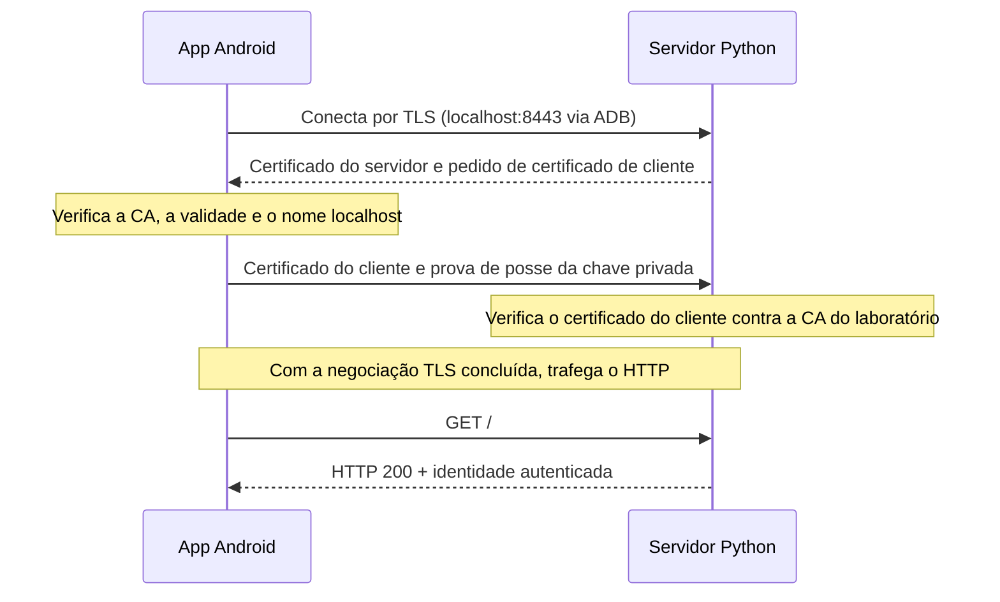

# Laboratório mTLS: Android + Python

Um projeto para estudar autenticação TLS mútua: um app Android apresenta um certificado
de cliente e um servidor Python exige que esse certificado tenha sido emitido pela CA
do laboratório. O app também verifica o certificado e o nome do servidor.

O servidor usa apenas a biblioteca padrão do Python e o OpenSSL instalado no sistema.
O app usa Java, `HttpsURLConnection` e o `KeyChain` do Android.

## Estrutura

```text
android-mtls-lab/
├── README.md
├── .gitignore
├── server/
│   └── lab.py                 # Certificados, servidor e testes locais
├── android/
│   ├── gradlew                # Gradle Wrapper: versão fixa e checksum
│   ├── gradle/wrapper/
│   └── app/src/
│       ├── main/              # Activity, manifesto e configuração básica de TLS
│       └── debug/             # Confiança na CA somente para depuração
├── scripts/
│   ├── prepare.sh             # Gera credenciais e prepara o app
│   ├── build-android.sh       # Prepara e compila o APK
│   └── run-server.sh          # Executa o servidor e grava sua saída
└── .local/                    # Gerada localmente; ignorada pelo Git
```

Para estudar tudo no VS Code, abra a pasta raiz: `code .`.
Para compilar ou depurar o app no Android Studio, abra a subpasta `android/`.

## O que acontece em uma conexão



Este desenho resume o fluxo; não representa todas as mensagens do protocolo.
A chave privada não é enviada ao servidor. O certificado contém a chave pública,
e a negociação TLS comprova a posse da chave privada correspondente.

Há duas configurações independentes no Android: **em quais servidores confiar** e
**qual identidade apresentar como cliente**. A primeira está no XML de segurança;
a segunda usa o `KeyChain`. A [documentação do Android sobre confiança em certificados](https://developer.android.com/privacy-and-security/security-config)
e a [referência de KeyChain](https://developer.android.com/reference/android/security/KeyChain)
explicam essas duas partes.

mTLS autentica a identidade. Decidir o que essa identidade pode fazer é uma etapa de
autorização da aplicação. Este servidor didático aceita qualquer certificado de
cliente válido emitido pela sua CA e devolve o CN; não implementa regras de permissão
por usuário.

## Pré-requisitos

Os comandos abaixo são para um terminal Bash no Linux, executados na raiz do projeto.

| Componente | Configuração deste projeto |
|---|---|
| Python e OpenSSL | Python 3 e OpenSSL 3; sem dependências pip; validado com Python 3.13 |
| Java | JDK 17 ou 21; validado com JDK 21 |
| Gradle | 8.11.1, fornecido pelo Wrapper |
| Android Gradle Plugin | 8.9.2 |
| SDK Android | Platform 35, Build-Tools 35.0.0 e Platform-Tools (`adb`) |
| Aparelho | Android 8.0 / API 26 ou superior, depuração USB autorizada |

Defina `JAVA_HOME` para o JDK e `ANDROID_HOME` para o SDK da sua máquina, com `java`,
`keytool` e `adb` no `PATH`. O Android Studio pode registrar o caminho do SDK em
`android/local.properties`, arquivo que fica fora do Git. Se estiver usando a linha
de comando do SDK, instale os componentes com:

```bash
sdkmanager "platform-tools" "platforms;android-35" "build-tools;35.0.0"
sdkmanager --licenses
```

A primeira compilação precisa de internet para obter o Gradle e as dependências.
As versões foram fixadas conforme a [compatibilidade do AGP 8.9](https://developer.android.com/build/releases/agp-8-9-0-release-notes).

## 1. Entender o mTLS sem o celular

```bash
python3 server/lab.py test
```

O comando gera credenciais locais se necessário, abre um servidor numa porta
temporária, faz cinco testes TLS reais e encerra esse servidor ao terminar.
Ele não ocupa a porta 8443 do servidor usado pelo app.

| Cenário | Resultado esperado |
|---|---|
| Certificado válido do cliente | HTTP 200 |
| Cliente sem certificado | Recusado pelo servidor |
| Cliente com certificado de outra CA | Recusado pelo servidor |
| Cliente não confia na CA do servidor | Recusado pelo cliente |
| Nome do endereço não corresponde ao certificado | Recusado pelo cliente |

## 2. Preparar e compilar o Android

```bash
./scripts/build-android.sh
```

Esse script gera as credenciais quando ausentes, copia **somente a CA pública** para
os recursos de depuração e compila o app. O APK fica em:

```text
android/app/build/outputs/apk/debug/app-debug.apk
```

Se preferir compilar pela IDE, execute `./scripts/prepare.sh` primeiro e abra
`android/` no Android Studio. Use JDK 17 ou 21 na configuração **Gradle JDK**.
O Java que executa a IDE pode ter outra versão; não precisa ser o Java do Gradle.

Os scripts preservam as credenciais existentes. O APK contém a CA pública do servidor;
o certificado e a chave privada do cliente serão importados separadamente no celular.

## 3. Iniciar o servidor

Em um terminal, execute e deixe aberto:

```bash
./scripts/run-server.sh
```

Ele escuta apenas em `127.0.0.1:8443`. Use `Ctrl+C` para encerrá-lo.
Se já existir um servidor nessa porta, reutilize-o somente se ele usa as mesmas
credenciais, ou encerre essa instância antes de iniciar outra.

O script mostra a saída na tela e a acrescenta a `.local/server.log`. Em outro terminal:

```bash
tail -n 50 -f .local/server.log
```

Nesta versão, o log registra a inicialização e eventuais erros de execução. Os acessos
HTTP e as recusas durante a negociação TLS ainda não têm registros próprios;
o resultado de cada tentativa aparece no app. `Ctrl+C` no `tail` encerra apenas
a visualização do log.

## 4. Instalar e conectar o celular

Conecte apenas o aparelho de teste, habilite a depuração USB e aceite a autorização
exibida nele. Em uma VM, direcione o dispositivo USB para o sistema convidado.

```bash
adb devices -l
```

O estado deve ser `device`. Em seguida:

```bash
adb install -r android/app/build/outputs/apk/debug/app-debug.apk
adb push .local/certs/client.p12 /sdcard/Download/mtls-client.p12
adb reverse tcp:8443 tcp:8443
adb reverse --list
```

O `adb reverse` liga a porta 8443 do celular à porta 8443 da máquina que executa o ADB.
Assim, `https://localhost:8443` no app chega ao servidor no Debian. Refaça esse
encaminhamento após desconectar o USB. Com mais de um aparelho, use `adb -s SERIAL ...`.

Abra **Laboratório mTLS** no celular:

1. Toque em **Importar certificado (.p12)** e selecione `mtls-client.p12` em Downloads.
2. Conclua a importação na interface do Android com a senha **`lab-android`**.
3. Toque em **Escolher identidade** e selecione `android-lab`.
4. Compare **Testar sem certificado**, que deve falhar, com **Testar mTLS**, que deve
   responder HTTP 200.

O Android pode exigir um bloqueio de tela para armazenar a credencial.
Uma resposta válida tem este formato; a versão do TLS depende da negociação:

```json
{"mtls": true, "cliente": "android-lab", "tls": "TLSv1.3"}
```

## 5. Fazer a mesma chamada pelo terminal

Com o servidor rodando, execute na raiz do projeto:

```bash
curl --noproxy '*' \
  --cacert .local/certs/ca.crt \
  --cert .local/certs/client.crt \
  --key .local/certs/client.key \
  https://localhost:8443/
```

Repita sem `--cert` e `--key`: a conexão deve ser recusada. Mantenha `--cacert`;
usar `-k` removeria a verificação do servidor que queremos estudar.

## Roteiro de leitura do código

| Arquivo / trecho | O que observar |
|---|---|
| [server/lab.py](server/lab.py) → `generate()` | CA, certificados com usos `serverAuth` e `clientAuth`, SAN `localhost` e PKCS12 |
| `server_context()` | Certificado do servidor, CA aceita para clientes e `ssl.CERT_REQUIRED` |
| `Server.get_request()` | Negociação TLS antes de qualquer processamento HTTP |
| `Handler.do_GET()` | Certificado já autenticado e resposta JSON |
| `client_context()` e `test()` | Experimentos positivos e negativos com TLS real |
| [MainActivity.java](android/app/src/main/java/lab/mtls/MainActivity.java) → `onActivityResult()` | Importação do `.p12` pela interface de credenciais do sistema |
| `test()` e `ClientIdentity` | Seleção da chave pelo `KeyChain` e uso de `X509ExtendedKeyManager` |
| [Configuração de depuração](android/app/src/debug/res/xml/network_security_config.xml) | CA do laboratório confiável apenas no app de depuração |

O app mantém a verificação padrão de hostname e o TrustManager padrão. Não há um
TrustManager que aceite qualquer certificado. O servidor usa `ssl.CERT_REQUIRED`
para exigir o certificado do cliente; veja também a [referência de TLS do Python](https://docs.python.org/3/library/ssl.html).

## Credenciais e arquivos gerados

Cada clone novo gera sua própria CA. `.local/certs/client.p12` contém a identidade
privada do cliente; sua senha `lab-android` é pública e serve apenas ao exercício.
As chaves PEM locais não têm senha. A CA dura 30 dias e os certificados de servidor
e cliente duram 7 dias. A chave de assinatura do APK é de depuração.

Para renovar o laboratório, pare o servidor, preserve as credenciais antigas e gere
outras. Este comando mantém a chave de assinatura do app:

```bash
mv .local/certs ".local/certs-anteriores-$(date +%Y%m%d-%H%M%S)"
./scripts/build-android.sh
```

Depois reinicie o servidor, reinstale o APK, transfira o novo `.p12`, importe-o e
selecione a nova identidade. Uma CA nova não funciona com o APK ou a identidade antigos.

Este é um laboratório local: não implementa gestão de usuários, revogação de
certificados, rotação automática ou operação de um serviço público.

## Problemas comuns

| Sintoma | O que conferir |
|---|---|
| `unauthorized` no ADB | Desbloqueie o aparelho e aceite a depuração USB |
| `Connection refused` ou timeout | Servidor iniciado e `adb reverse --list`; erro de rede não prova recusa do certificado |
| Falha de certificado mesmo com identidade selecionada | CA do APK, certificado do servidor e `.p12` devem pertencer ao mesmo laboratório; confira validade e relógio |
| `Address already in use` | Outra instância ocupa 8443; identifique-a com `ss -ltnp '( sport = :8443 )'` |
| `SDK location not found` | Ajuste `ANDROID_HOME` ou o SDK em `android/local.properties` |
| Erro de Java no Gradle | Confira `java -version`, `JAVA_HOME` e o Gradle JDK da IDE |
| `INSTALL_FAILED_UPDATE_INCOMPATIBLE` | Um app com o mesmo ID foi assinado com outra chave. Preserve a chave original ou desinstale o app anterior, ciente de que isso apaga seus dados |

## Publicar no GitHub

O `.gitignore` exclui `.local/`, credenciais, APKs, caches, configurações da máquina e
arquivos de compilação. O código, os scripts e o Gradle Wrapper devem ser versionados.
Confira os arquivos que entrarão no primeiro commit:

```bash
git init -b main
git add .
git diff --cached --stat
git diff --cached
git commit -m "Adiciona laboratório mTLS para Android e Python"
```

Se o Git pedir sua identidade, configure `user.name` e `user.email` com os valores
que deseja associar aos commits. Crie um repositório vazio no GitHub e substitua
`SEU_USUARIO` pela sua conta:

```bash
git remote add origin https://github.com/SEU_USUARIO/android-mtls-lab.git
git push -u origin main
```

Os comandos de publicação exigem a sua autenticação no GitHub. Compartilhe os arquivos
versionados; um ZIP manual de toda a pasta pode incluir `.local/`, pois o `.gitignore`
é respeitado pelo Git, não por compactadores comuns.
