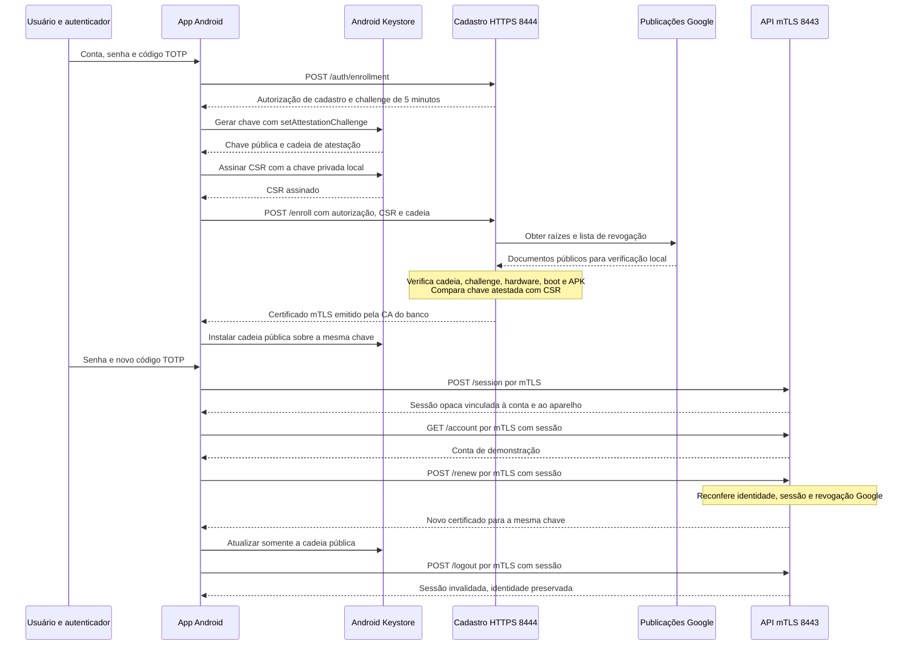

# Banco Lab: Android Key Attestation, login/MFA e mTLS

Laboratório de **chave exclusiva por instalação**. Esta pasta contém o projeto Android,
o servidor e seus scripts. Volte ao [índice do repositório](../README.md) para escolher
o laboratório de credencial compartilhada ou consultar a comparação entre os modelos.

Laboratório local de um app bancário comum, sem permissões privilegiadas. O app gera
uma chave RSA no **Android Keystore**, recebe uma cadeia de **atestação** e envia um
CSR e essa cadeia ao banco por HTTPS. O servidor valida a atestação contra raízes
publicadas pelo Google antes de emitir o certificado mTLS. Nenhuma chave privada do
celular é exportada, importada por `.p12` ou transmitida pelo ADB.

O cadastro exige **senha + TOTP**. Depois dele, o app entra novamente por **mTLS** para
obter uma **sessão de usuário**, válida por 15 minutos. A conta exige certificado mTLS
**e** sessão. A renovação do certificado ocorre exclusivamente por mTLS, com sessão válida.
O app declara somente `INTERNET` e usa APIs públicas do Android.

## O que o banco passa a confiar

O banco não aprova um aparelho apenas por ele dizer que é Xiaomi ou Samsung. Ele
confia nas raízes Google configuradas no servidor e verifica as declarações assinadas
sobre a chave, o app e o boot. Isso depende da segurança do ecossistema de atestação,
do hardware e dos componentes que fazem essas declarações. Não elimina toda confiança
na plataforma nem transforma um sistema comprometido em confiável.

Há duas cadeias independentes:

| Cadeia | Quem verifica | O que significa |
|---|---|---|
| Chave do app → certificados de atestação → raiz Google | Servidor do banco | Evidência sobre a origem/proteção da chave e o contexto atestado |
| Certificado do cliente → CA do banco | Servidor mTLS | Credencial emitida pelo banco após autorizar o cadastro |
| Certificado HTTPS do servidor → CA do banco | App de debug | Autentica o servidor local e protege login, MFA e cadastro |

**O Google não gera nem recebe a chave privada mTLS do app.** O Android gera essa chave
localmente. As chaves/cadeias usadas para atestá-la são provisionadas pela plataforma,
na fábrica ou via RKP (*Remote Key Provisioning*). Neste projeto, o servidor consulta
as URLs Google para baixar raízes e revogações; não envia a elas o CSR ou a cadeia do
celular. A validação da cadeia recebida acontece no Debian.

Usamos o [verificador oficial Android](https://github.com/android/keyattestation),
fixado no commit `55c35040a1b5b72e6d63bfb150c5c68a175c1462`. Um adaptador Kotlin roda
localmente como subprocesso do Python. A biblioteca ainda está antes da versão 1.0;
o commit fixo torna o exercício reproduzível e precisa de acompanhamento de atualizações.

A política exige:

- Cadeia assinada que termine em raiz obtida da [publicação oficial Google](https://android.googleapis.com/attestation/root), com a estrutura validada pelo verificador.
- Ausência de revogação/suspensão na [lista Google](https://android.googleapis.com/attestation/status). Estado desconhecido listado também é recusado.
- Challenge igual ao emitido pelo banco, associado à conta, com autorização válida por cinco minutos.
- Origem `GENERATED` em hardware e nível TEE ou StrongBox consistente com a cadeia.
- Boot `VERIFIED` e `deviceLocked=true`, extraídos da atestação.
- Pacote `lab.mtls`, versão mínima 3 e SHA-256 do certificado de assinatura esperado. `UnknownPackage` não recebe exceção.
- Chave pública atestada igual à do CSR RSA-2048, cuja assinatura também precisa ser válida.

As raízes e a política vêm da configuração do servidor; campos HTTP não podem
substituí-las. Sem verificador, política ou dados Google atuais, não há aprovação
silenciosa. O cache respeita `max-age`/`Age`, com teto de uma hora para status e um dia
para raízes. Se vencer e a atualização falhar, cadastro/renovação recebem HTTP 503.

Dispositivos antigos podem ter certificados de atestação provisionados na fábrica
que já expiraram. O verificador oficial trata essa exceção específica; as cadeias
RKP continuam sujeitas à validade. Isso não desativa a validade dos certificados
mTLS/HTTPS do laboratório. Consulte a
[documentação de atestação Android](https://developer.android.com/privacy-and-security/security-key-attestation)
e o [esquema de campos atestados](https://source.android.com/docs/security/features/keystore/attestation).

## Fluxo completo



O primeiro login autoriza **somente o cadastro**. Ele não cria sessão de conta.
O segundo login usa a identidade mTLS já instalada. Reutilizar o mesmo código TOTP
é recusado: aguarde o código seguinte. O formato de cadastro é próprio deste lab;
não implementa o protocolo EST completo.

| Porta e rota | Requisitos | Resultado |
|---|---|---|
| 8444 `POST /auth/enrollment` | HTTPS, `account`, `password`, `otp` | Grant e challenge de cadastro |
| 8444 `POST /enroll` | HTTPS, Bearer grant, `csr`, `attestation_chain` | Certificado público do cliente e CA |
| 8443 `POST /session` | mTLS ativo/atestado + login/MFA | Sessão opaca de 15 minutos |
| 8443 `GET /account` | mTLS + Bearer sessão vinculada ao aparelho | Dados de demonstração |
| 8443 `POST /renew` | mTLS + Bearer sessão + JSON `{}` | Certificado novo para a mesma chave |
| 8443 `POST /logout` | mTLS + Bearer sessão + JSON `{}` | Invalida a sessão |

A porta 8444 não tem rotas de conta, sessão ou renovação. A porta 8443 exige certificado
já na negociação TLS. Um certificado assinado pela CA, mas sem registro ativo e
atestado no banco, recebe HTTP 403. O app não faz fallback para HTTPS simples quando
uma operação mTLS falha. `TrustManager` e verificação de hostname continuam ativos.

## Estrutura e ordem sugerida de leitura

| Arquivo | O que estudar |
|---|---|
| [server/lab.py](server/lab.py) | PKI do banco, emissão, rotas, autorização do aparelho, renovação e logs |
| [server/auth.py](server/auth.py) | scrypt, TOTP, limitação de tentativas, grants e sessões |
| [server/attestation.py](server/attestation.py) | Política, cache Google, revogação, IPC e comparação das chaves |
| [Main.kt](server/attestation-verifier/src/main/kotlin/Main.kt) | Adaptador da biblioteca oficial e política de hardware/boot/APK |
| [server/test_lab.py](server/test_lab.py) | Integração com HTTPS/mTLS real e testes de autenticação |
| [server/test_attestation.py](server/test_attestation.py) | Cadeias sintéticas isoladas e casos de recusa do verificador real |
| [BankIdentity.java](android/app/src/main/java/lab/mtls/BankIdentity.java) | Geração atestada, alias, Keystore e instalação da cadeia do banco |
| [Pkcs10.java](android/app/src/main/java/lab/mtls/Pkcs10.java) | Codificação DER e assinatura do CSR |
| [BankApi.java](android/app/src/main/java/lab/mtls/BankApi.java) | Cadastro, sessão em memória e KeyManager mTLS |
| [MainActivity.java](android/app/src/main/java/lab/mtls/MainActivity.java) | Interface do exercício e execução fora da thread principal |
| [scripts/setup-attestation.sh](scripts/setup-attestation.sh) | Download do commit fixo e compilação do verificador |
| [scripts/prepare.sh](scripts/prepare.sh) | CA local e política vinculada ao certificado de assinatura de debug |

`.local/` contém dados privados e dependências baixadas. `server/` e `android/`
continuam juntos dentro de `per-installation-lab/`. Fontes de terceiros ficam em
`.local/keyattestation/`, incluindo a licença Apache 2.0 do projeto original.

## Preparar o ambiente

Execute os comandos em Bash, dentro de **`per-installation-lab/`**.
O README da raiz do repositório é apenas o índice dos dois laboratórios.

| Componente | Requisito |
|---|---|
| Python | 3.11+; VM validada com 3.13 e `cryptography==50.0.1` |
| Java | **JDK 21**, para o verificador e o Gradle |
| Git | Necessário para obter o commit fixo da biblioteca oficial |
| Android | SDK Platform 35, Build-Tools 35.0.0 e Platform-Tools/ADB |
| Aparelho | Android API 26+, com cadeia hardware aceita pela política |
| Rede do Debian | Maven/Google/GitHub na preparação; URLs Google de atestação em operação |

Nesta VM, carregue os caminhos instalados:

```bash
source /home/lucas/Documents/Codex/2026-09-17/x20/outputs/mtls-android/env.sh
cd /home/lucas/Documents/Codex/2026-09-17/x20/outputs/android-mtls-lab/per-installation-lab
./scripts/build-android.sh
server/.venv/bin/python server/lab.py test
```

Em outro computador, configure `JAVA_HOME`, `ANDROID_HOME` e `PATH` para seu JDK/SDK.
`build-android.sh` executa a preparação: cria `server/.venv`, instala a dependência
Python, compila o verificador oficial, inicializa a CA/SQLite, gera a assinatura local
de debug e configura o SHA-256 esperado dessa assinatura. Depois compila o APK.

Para preparar só o Python/verificador, use `./scripts/setup-server.sh`. Para preparar
CA e política sem compilar o Android, use `./scripts/prepare.sh`. O comando
`./scripts/setup-attestation.sh` recompila apenas o adaptador/verificador.

Se preferir ativar o ambiente virtual:

```bash
source server/.venv/bin/activate
python server/lab.py test
# Dentro de server/: source .venv/bin/activate e python lab.py test
deactivate
```

O APK fica em `android/app/build/outputs/apk/debug/app-debug.apk`. No Android Studio,
abra a pasta `per-installation-lab/android/` e configure o Gradle para JDK 21. No VS Code, abra esta pasta com
`code .`. A CA local é confiável apenas no build de debug; o release usa o trust store
padrão do Android. Um release real exige domínio/PKI e certificado de assinatura
configurados para esse ambiente.

## Criar uma conta e configurar o MFA

O laboratório usa um cadastro administrativo local de usuários. Isso representa a
conta já existente no banco; não implementa KYC, abertura de conta nem recuperação
comercial de identidade.

```bash
server/.venv/bin/python server/lab.py create-user --account aluno
```

Digite uma senha de 12 a 128 caracteres. O comando grava as informações TOTP em
`.local/bank/provision-aluno.json`, com permissão 600. Não sobrescreve um usuário
existente. Para gerar uma senha aleatória, use `--generate-password`; nesse caso,
a senha inicial também fica no arquivo de provisionamento.

Abra **localmente** esse arquivo no editor:

```bash
code .local/bank/provision-aluno.json
```

No seu autenticador TOTP, cadastre uma entrada usando `totp_secret` (Base32), seis
dígitos, período de 30 segundos e SHA-1; `otpauth_uri` descreve a mesma configuração.
O relógio do autenticador e o da VM precisam estar corretos. O servidor aceita uma
janela de ±30 segundos e rejeita um contador já utilizado. Esse perfil segue o
[TOTP, RFC 6238](https://www.rfc-editor.org/rfc/rfc6238.html).

**Nesta VM a conta `lucas` foi provisionada**, com os dados privados em
`.local/bank/provision-lucas.json`. Não precisa recriá-la.

O segredo TOTP não é embutido no APK nem fornecido por uma rota HTTP. Manter senha e
seed no mesmo arquivo é uma conveniência de provisionamento local: configure o fator
em um autenticador separado e proteja esse arquivo. Isso não modela a independência
operacional dos fatores num banco. Não coloque esse material no GitHub.

## Iniciar o servidor e ver os logs

```bash
./scripts/run-server.sh
```

Deixe o terminal aberto. O servidor escuta em `127.0.0.1:8444` e `127.0.0.1:8443`.
O script verifica a configuração local, encerra a instância anterior **deste projeto**
e inicia uma nova. Também reconhece uma execução manual de `python lab.py serve`.
Confere caminho e usuário do processo e usa pidfd; um PID antigo ou outra aplicação
na mesma porta não basta para autorizar encerramento. Reinícios são serializados
por lock. Tenta SIGTERM e, após cinco segundos, SIGKILL, preservando os dados.

`Ctrl+C` encerra a instância iniciada pelo script. O PID fica em `.local/server.pid`.
Em outro terminal, acompanhe:

```bash
tail -n 50 -f .local/server.log
```

| Evento | Como interpretar |
|---|---|
| `SERVIDOR_INICIADO` | Listeners de cadastro e mTLS iniciados |
| `GOOGLE_ATUALIZADO` | Raízes ou status atualizados; informa duração do cache |
| `MFA_OK finalidade=cadastro` | Login/MFA autorizou um challenge/grant, ainda não emitiu certificado |
| `ATESTACAO_OK` | Cadeia, política e vínculo com a chave do CSR aprovados |
| `ATESTACAO_RECUSADA motivo=...` | Razão da recusa pelo verificador, como revogação ou APK divergente |
| `CADASTRO_EMITIDO` | Identidade atestada associada à conta e certificado emitido |
| `TLS_OK servico=mtls` | Certificado aceito pelo TLS; a sessão ainda será verificada |
| `SESSAO_CRIADA` | Login/MFA por mTLS criou a sessão de usuário |
| `CERTIFICADO_RENOVADO` | Emissão/recuperação de renovação via mTLS |
| `SESSAO_ENCERRADA` | Sessão invalidada por logout |
| `HTTP_RESPOSTA` / `PEDIDO_RECUSADO` | Rota e status; distingue falha de sessão de falha de cadastro |
| `TLS_RECUSADO` | Falha anterior ao HTTP: sem certificado, CA incorreta ou expiração |

Não são registrados senha, TOTP, Bearer, CSR ou corpos de requisição. Os logs contêm
IDs das contas/aparelhos de teste. Um `TLS_OK` isolado não prova acesso autorizado à conta.

## Executar o fluxo no Xiaomi

Conecte o celular, autorize a depuração e confirme `device` em `adb devices -l`.
Depois:

```bash
adb install -r android/app/build/outputs/apk/debug/app-debug.apk
adb reverse tcp:8444 tcp:8444
adb reverse tcp:8443 tcp:8443
adb shell am start -n lab.mtls/.MainActivity
```

Se houver vários aparelhos, acrescente `-s SERIAL` após `adb`. Nesta VM, o Xiaomi é
`cda39059`. O ADB encaminha as portas e instala o APK; não fornece a chave mTLS.
Os encaminhamentos precisam ser refeitos se a conexão USB/ADB for perdida.

1. Informe conta, senha e TOTP. Toque em **“1. Cadastrar / retomar cadastro”**. O banco autoriza o challenge e o Android gera uma chave nova com ele.
2. Aguarde **“Atestação aprovada e certificado instalado”**. O app conserva a cadeia de atestação em memória até enviar o pedido e só depois instala a cadeia do banco sobre a mesma chave.
3. Aguarde o próximo TOTP, informe senha e código e toque em **“2. Entrar por mTLS”**. O estado da identidade e o da sessão aparecem separados.
4. Toque em **“3. Consultar conta”**. Deve retornar JSON com `mtls: true`, `user_session: true`, conta e ID do aparelho.
5. Toque em **“4. Renovar certificado por mTLS”** e consulte a conta novamente. O certificado muda; a chave e o vínculo da sessão com o aparelho permanecem.
6. Use **“Teste: mTLS sem sessão”**: deve receber HTTP 401 mesmo tendo certificado válido. **“Teste: sem certificado mTLS”** deve falhar na negociação TLS.
7. Use **“Sair da sessão”**. A identidade continua instalada, mas uma nova consulta requer login. Fechar o processo do app também perde a sessão local; o token no servidor expira em até 15 minutos.

Se a resposta do cadastro se perder, pressione o botão de cadastro novamente enquanto
a tela/processo mantém o pedido pendente. Ele reutiliza o grant, CSR e cadeia dentro
do prazo. Depois de expirar, é necessário novo login/MFA e nova chave. O cadastro
pode ser usado explicitamente para recuperação; não é disparado por uma falha mTLS.

O alias ativo só é substituído após receber e instalar um certificado válido. A
migração preserva registros e chaves do lab anterior, mas **não os considera atestados**.
Para a versão 3 é necessário novo cadastro. Limpar dados/desinstalar o app elimina
sua identidade; atualizar com `adb install -r` preserva os dados e a assinatura original.

## Sessão, renovação, expiração e revogação

| Credencial | Prazo/controle |
|---|---|
| Autorização de cadastro | 5 minutos, conta + challenge, uso único com repetição idêntica permitida |
| Sessão de usuário | 15 minutos, conta + ID do aparelho, logout e substituição por novo login |
| Certificado de cliente | 7 dias, limitado pela validade da CA |
| Certificado anterior após renovar | Até 5 minutos, limitado pela própria validade |
| Certificado HTTPS do servidor | 30 dias, limitado pela CA |
| CA local | 365 dias |

A renovação é manual no exercício. `/renew` exige certificado ainda válido, registro
ativo e sessão. O servidor verifica novamente a lista Google e emite um certificado
para **a mesma chave**. O mTLS já prova sua posse, então não é necessário novo CSR.
Repetir o pedido com o certificado anterior recupera a mesma emissão durante a
janela de tolerância; isso evita perder acesso se a resposta não chegar. O servidor
persiste essa informação no SQLite, inclusive após reinício.

Renovar o certificado não produz uma nova atestação nem prova o estado atual do boot.
Após 30 dias desde a atestação, o servidor recusa novas renovações e exige cadastro
com login/MFA, challenge e chave novos. O lab não implementa atestação contínua. Uma
revogação Google é consultada no cadastro/renovação, não em cada consulta de conta.
A revogação administrativa do banco é verificada em cada requisição mTLS:

```bash
server/.venv/bin/python server/lab.py devices
server/.venv/bin/python server/lab.py revoke --device ID_COPIADO_DA_LISTA
```

A próxima chamada recebe 403 mesmo com sessão válida. Um certificado expirado é
recusado pelo TLS: a recuperação exige cadastro explícito por login/MFA com nova
atestação. Nenhuma operação de conta ou renovação passa a aceitar HTTPS simples.

Para verificar e renovar **apenas o certificado HTTPS do servidor**:

```bash
openssl x509 -in .local/bank/server.crt -noout -dates
server/.venv/bin/python server/lab.py renew
./scripts/run-server.sh
```

Essa ação preserva CA e chave do servidor e dispensa recompilar o APK. Uma CA expirada
exige preparar um novo ambiente e recompilar a confiança de debug. Preserve o estado
anterior antes de recriá-lo, pois ele contém o histórico do exercício.

## Testar e interpretar o resultado

```bash
server/.venv/bin/python server/lab.py test
# Testes adicionais da dependência oficial
android/gradlew -p server/attestation-verifier --no-daemon --max-workers=2 :upstream:test
# Compilar o teste Android opcional
android/gradlew -p android --no-daemon --max-workers=2 assembleDebugAndroidTest
```

Os testes Python usam HTTPS/mTLS real e o verificador oficial com uma PKI sintética
criada em diretórios temporários. A substituição das raízes existe apenas nas classes
de teste. Um caso confirma que essas cadeias sintéticas são recusadas pelas raízes
Google. Os testes não emitem credenciais no estado real nem fingem que uma chave de
software do computador é hardware Android.

Cobrem senha/TOTP/replay, concorrência e expiração do grant, CSR inválido, divergência
de nonce/chave/APK, software/importação, boot, revogação/suspensão, extensão falsa de
cadeia, ausência de certificado/sessão, vínculo ao aparelho, logout, expiração,
renovação repetida e falha de rede Google sem perda da identidade antiga.

O teste Android opcional exige cadastro prévio pelo app e verifica Keystore persistente
e recusas sem sessão/certificado. Não embute credenciais. A MIUI deste Xiaomi bloqueou
a instalação do APK auxiliar de instrumentação em um teste anterior; por isso o
fluxo no aparelho é validado pela interface do APK principal, sem desativar essa proteção.

### Validação realizada nesta VM (28/09/2026)

- **26 testes do laboratório passaram**, usando TLS real e o verificador oficial.
- **180 testes da biblioteca oficial passaram**; APK principal e APK auxiliar compilaram.
- No **Redmi Note 8 / Android 10**, o cadastro real foi aprovado com TEE (`TRUSTED_ENVIRONMENT`), boot `VERIFIED` e `deviceLocked=true`.
- Login/MFA e consulta de conta funcionaram por **TLS 1.3**. O servidor foi reiniciado e a sessão persistiu.
- A renovação real emitiu outro certificado, preservando a chave pública, o ID do aparelho e a sessão. Uma consulta com o certificado renovado também retornou 200.
- Pela interface, acesso sem sessão recebeu 401 e acesso sem certificado falhou no TLS. Logout invalidou a sessão; reabrir o app preservou a identidade renovada.

Para validar automaticamente a interface nesta execução, as credenciais de teste foram
preenchidas pelo ADB a partir do arquivo local de provisionamento. Isso foi um smoke
test, não uma demonstração de independência dos fatores. O app/servidor não têm uma rota
de bypass de MFA ou atestação. Em uso manual, digite o código do seu autenticador.

## Guia dos arquivos e conceitos de criptografia

**Chave privada** é o segredo usado para assinar. A **chave pública** permite verificar
a assinatura. Uma assinatura verifica integridade e posse da chave; não esconde os dados.
Um **certificado X.509** associa uma chave pública a uma identidade, validade e usos,
com a assinatura de um emissor. Ele não contém a chave privada.

**CA**, *Certificate Authority* ou Autoridade Certificadora, é um papel, não uma extensão.
A raiz pública é confiável porque foi configurada como tal, não por ser autoassinada.
A cadeia mTLS é `certificado do app → ca.crt`, sem intermediárias. A cadeia de atestação é distinta: `chave do app → emissor de atestação → intermediária(s) → raiz Google`. O servidor assina
com `ca.key`; o app confia no servidor por meio da CA pública no APK de debug.
[Modelo X.509 e validação de certificados, RFC 5280](https://www.rfc-editor.org/rfc/rfc5280.html).

Extensão, codificação e conteúdo são conceitos distintos. Um arquivo `.crt` pode
conter um certificado codificado em PEM ou DER. Renomear o arquivo não converte seu
formato. **PKCS** significa *Public-Key Cryptography Standards*: PKCS#8 descreve
chaves privadas; PKCS#10, pedidos de certificado; PKCS#12, contêineres de credenciais.

| Extensão/conceito | Significado criptográfico e uso neste laboratório |
|---|---|
| `.key` | Convenção para arquivo de chave. `ca.key` e `server.key` são chaves privadas RSA em PKCS#8/PEM sem senha, protegidas por permissões locais. A chave Android não tem um arquivo `.key` exportável no projeto. |
| `.crt` / `.cer` | Convenções para certificados públicos X.509. Usamos `ca.crt` e `server.crt` em PEM. O certificado do cliente fica no banco e no Keystore, sem arquivo transferido manualmente. |
| `.pem` | Representação textual com Base64 entre `BEGIN`/`END`; pode conter certificado, chave ou CSR. `lab_ca.pem` contém só a CA pública. Nem todo PEM é público. |
| `.der` | Codificação binária *Distinguished Encoding Rules* de estruturas ASN.1. O CSR é montado em DER antes de ser convertido em PEM; binário não significa cifrado. |
| `.csr` | *Certificate Signing Request*, PKCS#10: chave pública, nome solicitado e assinatura do solicitante. Não contém chave privada. No app, o CSR fica em memória e segue no JSON HTTPS. |
| `.ext` | Convenção do laboratório anterior para configurações OpenSSL. Não é um certificado. Agora as extensões X.509 são definidas por `leaf_certificate()` no Python. |
| `.p12` / `.pfx` | Contêiner PKCS#12 que pode reunir chave privada, certificado e cadeia, com proteção por senha. Era usado no laboratório anterior; o novo fluxo não gera nem importa esse pacote. |
| `.keystore` / `.jks` | Nomes comuns para armazenamento de chaves/certificados. JKS (*Java KeyStore*) e PKCS#12 são formatos diferentes. `.local/debug.keystore` é PKCS#12 e serve para assinar o APK, não para mTLS. |
| Android Keystore | Serviço/provedor do Android, não uma extensão nem o arquivo `debug.keystore`. Armazena a chave privada da instalação sob um alias `bank-attested-<UUID>` e executa assinaturas por referência. |
| `alias` | Nome local de uma entrada no armazenamento de chaves; não é senha, certificado nem identificador que o banco precise aceitar. |

**PEM**, nome herdado de *Privacy-Enhanced Mail*, usa rótulos como `CERTIFICATE`,
`PRIVATE KEY`, `ENCRYPTED PRIVATE KEY` ou `CERTIFICATE REQUEST`. Base64 é uma codificação
reversível sem senha, não criptografia. ASN.1 significa *Abstract Syntax Notation One*,
a linguagem de descrição das estruturas. [Representações textuais, RFC 7468](https://www.rfc-editor.org/rfc/rfc7468.html).

Em um `.p12` protegido, a senha permite decifrar o conteúdo e conferir um **MAC**
(*Message Authentication Code*). Esse MAC não é a assinatura da CA e a senha não
participa da negociação mTLS. Importar uma chave não apaga as cópias que já existiam
fora do dispositivo. [Contêiner PKCS#12, RFC 7292](https://www.rfc-editor.org/rfc/rfc7292.html).

O arquivo de assinatura do APK continua tendo a senha pública de debug `android` e
alias `androiddebugkey`. A chave privada de assinatura não é embutida no APK. O Android
Keystore do cliente mTLS não usa essa senha. A identificação do formato real pode ser
feita pelo `keytool`; a extensão sozinha não o garante.
[Referência do keytool](https://docs.oracle.com/en/java/javase/21/docs/specs/man/keytool.html).

### Assinatura do TLS e permissões da chave

A chave RSA autoriza `DIGEST_NONE` e `ENCRYPTION_PADDING_NONE` para a operação
interna usada pelo Conscrypt do Android 10: a pilha TLS já prepara o hash e o padding
antes de solicitar a operação privada. O CSR usa `SHA256withRSA`; o TLS negocia
seu esquema de assinatura. Esses parâmetros não significam TLS sem integridade ou
tráfego sem criptografia. A finalidade da chave continua `PURPOSE_SIGN`, e o app
não oferece uma operação de assinatura arbitrária para outros aplicativos.
[Parâmetros de chaves usadas em TLS no Android](https://developer.android.com/reference/android/security/keystore/KeyGenParameterSpec.Builder#setDigests(java.lang.String...)).

### Campos do certificado

| Campo | O que significa e como usamos |
|---|---|
| `Subject` / `Issuer` | Titular e emissor. Os textos sozinhos não provam confiança: é preciso verificar assinatura e cadeia. |
| CN (*Common Name*) | No cliente, ID da instalação gerado pelo banco. O `pending-enrollment` do CSR não é uma conta autorizada. |
| SAN (*Subject Alternative Name*) | Nomes/endereços que o cliente verifica no servidor: `localhost` e `127.0.0.1`. |
| `notBefore` / `notAfter` | Início e fim da validade; relógios errados podem causar falhas. |
| Número de série | Identificador do certificado no contexto do emissor, gerado aleatoriamente. |
| `basicConstraints` | `CA:FALSE` para servidor/cliente; raiz com `CA:TRUE,pathlen:0`. |
| `keyUsage` | Assinatura digital para identidades TLS; assinatura de certificados/CRLs para a CA. |
| `extendedKeyUsage` | `serverAuth` no servidor, `clientAuth` no cliente. |
| SKI / AKI | Identificadores que ajudam a relacionar a chave do titular e a do emissor. |
| `critical` | O verificador precisa reconhecer e processar essa extensão. |

Uma **fingerprint** é um hash do certificado completo. **SHA-256** produz um resumo
criptográfico de tamanho fixo; não é uma cifra que possa ser decifrada. Renovar um
certificado muda sua fingerprint, mesmo preservando a chave pública. A API usa a
fingerprint para localizar a identidade depois da validação TLS; ela não substitui
a verificação da assinatura ou da validade.

O CSR é assinado pela chave do aparelho, provando posse dessa chave. O certificado
emitido é assinado pela CA, representando a decisão do banco. A CA pode alterar o
nome e as extensões solicitadas, como faz este laboratório.
[Pedido PKCS#10, RFC 2986](https://www.rfc-editor.org/rfc/rfc2986.html).

### Inspeção sem imprimir chaves privadas

```bash
# Identidade pública do servidor, datas, SAN e usos
openssl x509 -in .local/bank/server.crt -noout -text

# Cadeia e finalidade do servidor
openssl verify -CAfile .local/bank/ca.crt -purpose sslserver .local/bank/server.crt

# Formato e alias da assinatura do APK
keytool -list -keystore .local/debug.keystore -storepass android

# Os dois hashes abaixo devem coincidir: compara apenas a chave pública
openssl x509 -in .local/bank/server.crt -pubkey -noout \
  | openssl pkey -pubin -outform DER | openssl dgst -sha256
openssl pkey -in .local/bank/server.key -pubout -outform DER \
  | openssl dgst -sha256
```

Essa comparação de chaves não verifica validade ou confiança. A chave do Android
não está disponível para fazer a segunda operação no Debian: sua referência permanece
no Keystore, e a assinatura do CSR/mTLS demonstra que o app consegue usá-la.

### Outras extensões

| Extensão/nome | Papel |
|---|---|
| `.py` | Código Python do servidor e testes |
| `.java` | Código Android e testes no aparelho |
| `.kt` / `.kts` | Código Kotlin do adaptador de atestação e scripts Gradle Kotlin |
| `.json` | Mensagens HTTP/IPC, política, cache Google e provisionamento local; alguns contêm segredos |
| `.xml` | Manifesto, permissão de rede e configuração de confiança TLS |
| `.gradle` | Scripts de build, versões do SDK e assinatura do APK |
| `.properties` | Configurações chave/valor, como Gradle Wrapper e SDK local |
| `.sh` / `.bat` | Scripts de terminal Linux/Windows |
| `gradlew` | Script sem extensão que inicia o Gradle Wrapper |
| `.jar` | Arquivo Java: Gradle Wrapper e biblioteca/adaptador do verificador de atestação |
| `.apk` | Pacote instalável e assinado do app, não um certificado |
| `.db` | SQLite: usuários, hashes de senha/tokens, TOTP cifrado, atestações, sessões, certificados e revogações |
| `.txt` | Texto; `requirements.txt` fixa a dependência Python |
| `.md` | Documento Markdown, como este README |
| `.log` | Eventos de execução; pode conter identificadores das contas de teste |
| `.pid` | Número de processo, quando registrado por um lançador local |
| `.zip` | Arquivo compactado dos fontes; compactação não é criptografia |
| `.gitignore` / `.gitattributes` | Regras de versionamento, exclusões e tratamento de arquivos |
| `.venv/` / `.local/` | Diretórios do ambiente Python e dos dados gerados; não são formatos criptográficos |
| `ready` | Marcador de inicialização; não garante que os certificados ainda estejam válidos |

### Segredos e identidades na versão 3

- **Challenge/nonce:** 32 bytes aleatórios, codificados em Base64. Não é uma senha. A assinatura da atestação vincula esse desafio à chave pública, e o banco vincula o desafio à conta/autorização e ao prazo.
- **Senha:** o banco guarda salt aleatório e resultado de `scrypt` (`N=32768, r=8, p=1`). A senha não é guardada em texto no SQLite.
- **TOTP:** segredo simétrico compartilhado com o autenticador. O servidor precisa recuperá-lo para conferir o código, por isso guarda-o cifrado com Fernet. `mfa.key`, protegido por permissões, permite decifrá-lo; não equivale a um HSM.
- **Grant de cadastro e sessão:** tokens opacos aleatórios de 256 bits. O banco guarda apenas SHA-256; o grant não autoriza `/account`. A sessão é vinculada à conta e ao ID do aparelho.
- **Certificado de assinatura do APK:** identifica quem assinou o pacote. O SHA-256 desse certificado é comparado com `attestationApplicationId`; é diferente da chave de assinatura TLS do aparelho.
- **`.local/bank/provision-*.json`:** contém o segredo TOTP e, quando a senha foi gerada, a senha inicial. É material privado de provisionamento, não documentação pública.

## Problemas comuns

| Sintoma | O que verificar |
|---|---|
| ADB `unauthorized` | Desbloqueie o celular e autorize o computador |
| Conexão recusada/timeout | Servidor e os dois encaminhamentos ADB |
| HTTP 401 no login | Conta, senha, TOTP, relógio e código ainda não usado |
| HTTP 429 | Limite local: 5 tentativas por conta/minuto e 30 logins globais/minuto |
| HTTP 401 em `/account` | Sessão expirada, ausente, encerrada ou de outro aparelho |
| HTTP 401 no cadastro | Grant ausente/expirado; obtenha novo com login/MFA |
| HTTP 409 no cadastro | Grant usado com outro pedido; não gere outro CSR no mesmo grant |
| `PATH_REVOKED` | Certificado da cadeia está na lista Google; não ignore a revogação |
| `CONSTRAINT_Attestation application ID` | Pacote/versão/assinatura divergentes da política |
| `BOOT_NOT_LOCKED_AND_VERIFIED` | Boot não atende à política; não tente bloquear bootloader com dados/ROM desconhecidos como correção automática |
| `PATH_NO_TRUST_ANCHOR` | Cadeia sem raiz Google aceita; não confie na raiz que o próprio cliente enviar |
| HTTP 503 | Verificador/política/rede Google/cache atual indisponível, ou limite de verificações simultâneas |
| `certificate has expired` | Confira validade e relógios de CA, servidor e cliente; veja a recuperação acima |
| `Trust anchor ... not found` | APK debug e servidor precisam usar a mesma CA local |
| `INSTALL_FAILED_UPDATE_INCOMPATIBLE` | Preserve a chave original de assinatura; desinstalar apaga a identidade |
| `Address already in use` | `run-server.sh` só encerra instâncias deste projeto; confira outro ocupante com `ss -ltnp` |

## Limites que continuam sendo de laboratório

Há login/MFA, atestação verificada no servidor, sessão separada e renovação mTLS de
verdade. Isso ainda não é um backend bancário para publicação:

- A conta e o MFA são provisionados pelo operador. Não há IdP/OIDC, KYC, recuperação robusta, detecção de fraude, autorização de pagamentos ou confirmação de transação.
- A CA e a chave Fernet ficam em arquivos locais. Um operador com acesso a elas/ao banco pode alterar a confiança; não há HSM, serviço de emissão isolado ou controles operacionais de produção.
- O APK usa assinatura de debug local e é instalado por ADB. Em publicação Play, a política precisa usar o certificado de **App Signing** correto. Key Attestation não prova, sozinha, que a instalação veio da Play Store e não substitui Play Integrity.
- Atestação registra um momento. Não prova ausência de malware para sempre, não impede todo relay/hooking e não garante consentimento da pessoa para cada operação. Não exigimos patches recentes nem autenticação biométrica por assinatura.
- O login limita tentativas em SQLite; HTTPS tem limite de corpo, timeouts, oito workers por serviço e dois verificadores simultâneos. Esses limites locais não são proteção distribuída contra abuso/DoS.
- Não há TLS terminator/gateway, alta disponibilidade, limpeza operacional de registros antigos, renovação automática em background ou operação de produção da lista de dispositivos.

A cadeia de atestação aprovada é armazenada junto ao registro para auditoria e
rechecagem de revogação na renovação. Evite usar dados de pessoas reais neste projeto.

## Subir os fontes no GitHub

O `.gitignore` exclui `.local/`, credenciais, certificados gerados, logs, APKs, venv,
artefatos Kotlin/Gradle e caches. Revise o que será enviado:

```bash
git status --short
git add README.md android scripts server .gitignore .gitattributes
git diff --cached --stat
git diff --cached
```

Não adicione `.local/` com `--force`, nem compacte toda a pasta incluindo o estado.
Cada clone gera sua própria CA, assinatura debug, política e banco. O build baixa o
commit fixo da biblioteca oficial. O pacote de fontes deste laboratório inclui os
scripts e o adaptador, sem os segredos locais ou binários gerados.
