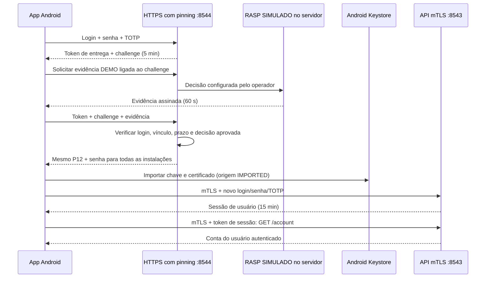

# mTLS com uma credencial compartilhada

Segundo laboratório do [mesmo repositório](../README.md), em uma pasta independente.
Aqui o **servidor gera uma única chave privada RSA e um certificado clientAuth** e
entrega cópias do mesmo `.p12` às instalações autorizadas. O app importa a chave no
Android Keystore e a usa em conexões mTLS. A chave não é transportada pelo ADB.

**O RASP é uma simulação autorizada para estudo. Não detecta root, Frida ou malware.**
O operador escolhe `approved`, `blocked` ou `unavailable` no servidor. O simulador
emite evidência assinada, ligada ao challenge e à autorização de entrega. Isso
exercita o contrato de integração e as recusas, sem atestar a integridade do celular.
O modo `--rasp-provider bank` falha com HTTP 503 porque o RASP real não foi integrado.

O cenário de certificado compartilhado é uma premissa deste exercício. Este projeto
não reproduz nem verifica a implementação interna do Appdome.

## O que é real neste lab

- HTTPS com validação de CA e hostname e **pinning SHA-256 do SPKI** do servidor.
- Login com senha + TOTP para autorizar a entrega; autorização válida por cinco minutos.
- `.p12` criptografado, transferido por HTTPS; sua senha também chega pelo canal autenticado.
- Importação pelo provider **AndroidKeyStore**, com origem `IMPORTED`.
- mTLS obrigatório na API, com `ssl.CERT_REQUIRED`, e autorização do fingerprint esperado.
- Sessão de usuário separada: senha + TOTP por mTLS geram um token de 15 minutos.
- Revogação global da credencial nas verificações de autorização de cada requisição.

A proteção em hardware após importar depende do aparelho e é exibida por `KeyInfo`.
Esse resultado é uma **informação local**, não uma atestação remota validada pelo banco.
Importar no Keystore não elimina as cópias anteriores no servidor, em outros clientes
ou na memória do app durante a importação.

## Fluxo completo



O app não envia um simples `safe=true` para aprovar a entrega. A assinatura da
evidência DEMO protege o vínculo e impede adulteração do protocolo; **não transforma
a decisão simulada em prova sobre root/Frida**. Um cliente que reproduza o protocolo
e tenha login/MFA consegue obter a credencial quando o operador aprova a simulação.

## Preparar e executar

Pré-requisitos: Linux, Python 3.11+ com `venv`, JDK 17+ (validado com JDK 21), Android
SDK Platform 35, Platform Tools/ADB e acesso aos repositórios Python/Gradle na primeira
preparação. O Gradle Wrapper está incluído. Não requer emulador nem permissões Android
privilegiadas. O app declara apenas `INTERNET`, com backup e cleartext desativados.

Na VM atual, os caminhos do JDK/SDK podem ser carregados antes de começar:

```bash
source /home/lucas/Documents/Codex/2026-09-17/x20/outputs/mtls-android/env.sh
cd /home/lucas/Documents/Codex/2026-09-17/x20/outputs/android-mtls-lab/shared-credential-lab
```

Em outra máquina, clone o repositório, entre em `shared-credential-lab/` e configure
`JAVA_HOME`, `ANDROID_HOME` e `PATH` para seus próprios JDK/SDK. Os próximos comandos
são executados **dentro desta pasta**, não na raiz do laboratório anterior.

### 1. Preparar PKI, Python e APK

```bash
./scripts/build-android.sh
```

O comando prepara `server/.venv`, instala `requirements.txt`, cria a PKI em
`.local/shared/`, gera os pins/CA públicos para o APK de debug e compila o app.
Rodar novamente preserva o estado e as chaves existentes. O RASP começa **bloqueado**
na primeira preparação. Builds release estão desabilitadas neste projeto demonstrativo,
evitando gerar por engano uma versão sem a configuração local de pinning.

### 2. Criar sua conta e configurar TOTP

```bash
server/.venv/bin/python server/lab.py create-user lucas \
  --output .local/shared/provision-lucas.json
```

Digite uma senha de pelo menos 12 caracteres. O arquivo privado contém `totp_secret`
e `otpauth_uri` para cadastrar a conta em um autenticador. Abra esse arquivo localmente
e copie o segredo no autenticador; não o coloque no Git nem em capturas de tela.
O servidor guarda a senha derivada com scrypt e o segredo TOTP cifrado com uma chave
local. A chave local junto do banco não substitui um secret manager/HSM de produção.

Para testar tudo nesta VM sem outro autenticador, um código pode ser calculado
localmente a partir do arquivo privado (isto reduz a independência dos fatores):

```bash
server/.venv/bin/python - <<'PY'
import json, sys, time
sys.path.insert(0, 'server')
import auth
with open('.local/shared/provision-lucas.json') as f:
    user = json.load(f)
print(auth.totp(user['totp_secret'], int(time.time() // 30)))
PY
```

O código muda a cada 30 segundos e **não pode ser reutilizado** após um login válido.
Conta/senha/TOTP do laboratório anterior não são copiados para este banco.

### 3. Iniciar o servidor e escolher a decisão simulada

```bash
server/.venv/bin/python server/lab.py rasp approved
./scripts/run-server.sh --diagnostics
```

O script encerra somente a instância anterior **deste** servidor, após verificar o
estado, e inicia outra. Não encerra o servidor da raiz do repositório. Fica em primeiro
plano; `Ctrl+C` encerra. Para continuar trabalhando, deixe esse terminal aberto.

| Listener | Função |
|---|---|
| `https://localhost:8544` | Bootstrap HTTPS com pinning; login, RASP DEMO e entrega |
| `https://localhost:8543` | API que exige certificado mTLS |
| `https://localhost:8545` | Diagnóstico: mesma CA e hostname, chave **fora** dos pins |
| `https://localhost:8546` | Diagnóstico: chave correspondente ao pin de reserva |

Todos escutam apenas em `127.0.0.1`. `--diagnostics` habilita os dois últimos.
Esses listeners de diagnóstico só expõem `/health`, nunca login ou chaves.

### 4. Instalar e conectar o celular

Com depuração USB autorizada e o celular visível em `adb devices`:

```bash
./scripts/connect-phone.sh
# Se houver vários aparelhos:
./scripts/connect-phone.sh cda39059
```

O script configura `adb reverse` nas quatro portas e instala
`android/app/build/outputs/apk/debug/app-debug.apk`. No Xiaomi, confirme a instalação
via USB se solicitado. O app **mTLS Compartilhado** (`lab.mtls.shared`) convive com o
app anterior (`lab.mtls`). O ADB instala o APK e encaminha portas; **não copia o P12**.
Após reconectar o USB, execute novamente o script para refazer os encaminhamentos.

Para abrir no Android Studio: selecione a pasta `shared-credential-lab/android/`.

### 5. Usar o app

1. Digite conta, senha e TOTP. Toque em **Receber chave via HTTPS + pinning**.
2. Confira `Origem: IMPORTED`, validade, fingerprint e a informação local de hardware.
3. Aguarde um **novo TOTP**, preencha novamente senha/código e toque em **Login/MFA por mTLS**.
4. Toque em **Consultar conta**. A resposta identifica a conta da sessão e informa o TLS.
5. **Ver identidade mTLS (sem sessão)** mostra somente a identidade compartilhada;
   não retorna dados bancários e não substitui o login.

As senhas/códigos são apagados dos campos após uma operação. O token de sessão fica
somente na memória do app e se perde ao fechar o processo. O alias no Keystore persiste.
Após receber o bundle, o app tenta limpar buffers controláveis; objetos Java/Strings e
internos do provider não permitem garantir que todas as cópias de memória sejam zeradas.

## Experimentos

**Pinning real:** use os três botões de pin. Principal e reserva devem responder `ok`;
o listener 8545 deve falhar especificamente com `Pin verification failed`. Falha de
rede ou certificado expirado **não conta** como prova de pinning. Os três certificados
são válidos para `localhost` e assinados pela mesma CA. O app usa Network Security
Configuration sem `debug-overrides`, com `overridePins="false"` e sem expiração do pin-set.
Não há TrustManager permissivo nem bypass de hostname.

**RASP bloqueado/indisponível:** em outro terminal, nesta pasta:

```bash
server/.venv/bin/python server/lab.py rasp blocked
# Tente receber a chave com login/MFA novo: HTTP 403.
server/.venv/bin/python server/lab.py rasp unavailable
# Tente novamente: HTTP 503, nenhuma chave entregue.
server/.venv/bin/python server/lab.py rasp approved
```

O controle RASP deste exercício atua **na entrega**, não continuamente. Bloquear o
simulador não apaga uma chave já importada nem revoga sessões existentes. Esse limite
é relevante para discutir o que o RASP real deve controlar durante toda a execução.

**mTLS versus sessão:** `Testar sem certificado` deve falhar no TLS. `Testar sem sessão`
deve retornar HTTP 401, mesmo com a chave importada. O sucesso de mTLS sozinho não
autoriza acesso a uma conta bancária.

**Revogação compartilhada:**

```bash
server/.venv/bin/python server/lab.py credential revoked
# Toda instalação com esta credencial recebe HTTP 403 na API e na entrega.
server/.venv/bin/python server/lab.py credential active
```

É uma lista de autorização local checada por requisição, **não CRL/OCSP no handshake**.
Reativar é uma conveniência do lab. Revogar de verdade uma chave comprometida exige
substituí-la; devolver `active` à mesma chave não corrige o comprometimento.

**Duas instalações:** repita o provisionamento em outro aparelho com uma conta
autorizada. Compare o SHA-256 mostrado nos dois: será igual. As cópias no Keystore
estão sob UIDs próprios, mas contêm a mesma chave criptográfica. O backend não pode
distinguir esses clientes por esse certificado. Os testes Python também demonstram
duas cópias independentes usando a mesma identidade.

## Logs e testes

```bash
tail -f .local/server.log
server/.venv/bin/python -m unittest discover -s server -v
```

Eventos: `BOOTSTRAP_AUTORIZADO`, `RASP_SIMULADO`,
`CREDENCIAL_COMPARTILHADA_ENTREGUE`, `SESSAO_USUARIO_CRIADA`, `CONTA_ACESSADA`,
`TLS_RECUSADO_OU_CONEXAO_ENCERRADA`. Não registramos P12, senhas, códigos MFA ou tokens.
Contas/fingerprints aparecem para correlação didática; produção requer política de logs.
O log do servidor não prova pinning do app: essa prova é a recusa observada no Android.

Os testes usam diretórios temporários, portas efêmeras e TLS real. Cobrem autorização,
MFA/replay, RASP adulterado/expirado/vinculado a outro pedido, recusa/indisponibilidade,
entrega idempotente, identidade compartilhada, sessões, revogação global, isolamento dos
listeners e configuração dos pins. O teste de pinning em execução ocorre no Android.
Veja [VALIDATION.md](VALIDATION.md) para os resultados observados.

## Código e arquivos criptográficos

| Arquivo | Papel |
|---|---|
| `server/lab.py` | Endpoints HTTPS/mTLS, grants, sessões, autorização e CLI |
| `server/auth.py` | Senha scrypt, TOTP, limitação local de tentativas |
| `server/rasp.py` | Simulador assinado e adaptador de banco que falha até ser integrado |
| `server/pki.py` | CA, certificados, P12 e pins públicos de debug |
| `android/.../SharedApi.java` | Protocolo HTTPS/mTLS usando a validação padrão Android |
| `android/.../SharedIdentity.java` | Abre PKCS#12, valida a cadeia e importa no AndroidKeyStore |
| `android/.../MainActivity.java` | Fluxo didático e diagnósticos |
| `.local/shared/ca.key` / `ca.crt` | Chave privada da CA e certificado público raiz local |
| `.local/shared/server.key` / `server.crt` | Chave/certificado HTTPS principal; SPKI fixado no APK |
| `.local/shared/backup-server.*` | Segunda chave/certificado para testar pin de reserva |
| `.local/shared/unpinned-server.*` | Terceira chave válida na CA, excluída dos pins |
| `.local/shared/shared-client.key` / `.crt` | Chave privada e certificado clientAuth compartilhados |
| `.local/shared/shared-client.p12` | PKCS#12: chave privada + certificado + cadeia, protegidos por senha |
| `.local/shared/p12-password` | Senha de transporte do P12; o servidor a envia ao app autorizado |
| `.local/shared/rasp-demo.key` | Segredo HMAC do simulador; nunca entregue ao app |
| `.local/shared/shared.db` / `mfa.key` | Estado de autenticação e chave local que cifra os segredos TOTP |
| `.local/debug.keystore` | Chave de assinatura do APK de debug, distinta das chaves TLS |

`.key`, `.crt` e `.pem` indicam convenções de arquivo; neste lab chaves/certificados
individuais usam PEM (Base64 de estruturas DER entre delimitadores). `.crt` é público;
`.key` contém segredo. `.p12`/`.pfx` são containers PKCS#12, não chaves públicas isoladas.
O pin fixa o **hash da chave pública do servidor** (SPKI), não a senha nem o fingerprint
do certificado cliente. A CA emite/assina certificados; não é um serviço Google aqui.

Só o material **público** (CA e pins) entra no APK. Estado privado, `.venv`, logs, APKs,
builds e configuração gerada estão no `.gitignore`. `git status` na raiz do repositório
deve mostrar apenas código/documentação. Não há outro `.git` dentro desta pasta.

### Compatibilidade PKCS#12 no Android 10

O provider nativo do Xiaomi recusou o container PBES2 gerado pelo padrão atual,
com `SecretKeyFactory not available` para o OID de PBKDF2. Por isso, este lab gera
o P12 com **PBESv1/3DES, MAC SHA-1 e 50.000 iterações**, perfil legado de compatibilidade.
Ele tem proteção inferior ao perfil moderno e não deve ser tomado como fronteira
de segurança. Essa escolha afeta o container; os certificados continuam assinados
com RSA/SHA-256 e o transporte continua HTTPS com pinning, sem habilitar 3DES no TLS.
Para um app real, avalie suporte dos providers e um formato de transporte moderno.
Veja a [documentação oficial do gerador PKCS#12](https://cryptography.io/en/latest/hazmat/primitives/asymmetric/serialization/#pkcs12).

## Validade, repetição e limites

Certificados folha duram 30 dias e a CA 365. `lab.py check` recusa estado expirado
antes de reiniciar o servidor. Este v1 ainda **não implementa rotação distribuída**.
Para recomeçar com outra PKI, encerre o servidor, mova `.local/shared/` para uma cópia
privada fora do Git e execute `build-android.sh`; crie a conta novamente e reinstale
o APK com os novos pins. Receba a nova credencial no app e faça novo login. Não
desative verificações de validade para contornar certificado expirado.

O pin de reserva permite uma futura troca controlada de chave do servidor; o listener
de diagnóstico comprova a aceitação dessa chave, sem implementar toda a automação de
rotação. A chave cliente compartilhada exige planejamento próprio de distribuição,
sobreposição e revogação. No laboratório anterior, a renovação por mTLS já existe.

Servidor Python/SQLite, CA e chaves em arquivos e RASP DEMO são escolhas didáticas.
Não há integração IdP bancária, HSM, Play Integrity, antifraude ou RASP comercial.
A senha do P12 precisa ficar disponível ao código que o importa; não pode permanecer
conhecida exclusivamente pelo time de Segurança nesse desenho. Pinning e RASP real
podem dificultar ataques, mas não tornam a chave originalmente compartilhada exclusiva
de cada instalação. Veja a [comparação](COMPARISON.md).

Referências oficiais: [Android Network Security Configuration](https://developer.android.com/privacy-and-security/security-config),
[Android Keystore](https://developer.android.com/privacy-and-security/keystore),
[KeyProtection e importação](https://developer.android.com/reference/android/security/keystore/KeyProtection).
